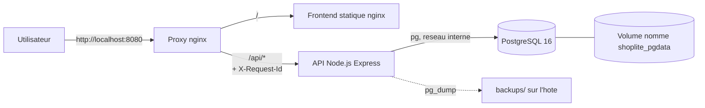
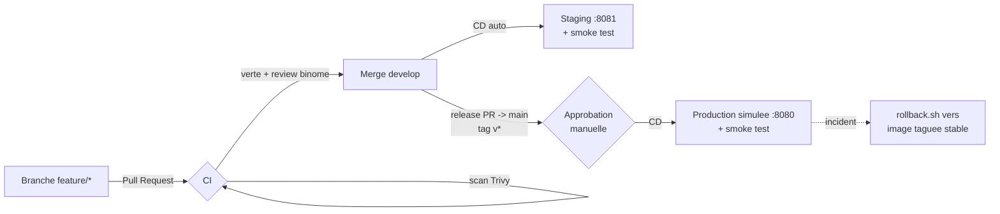

# Architecture ShopLite

## Vue d'ensemble (runtime)

- **Un seul point d'entree public** : le proxy nginx. L'API, le frontend et la
  base ne sont pas exposes sur l'hote.
- Le proxy injecte un `X-Request-Id` propage dans tous les logs JSON de l'API.
- Les donnees vivent dans le volume nomme `shoplite_pgdata` : il survit aux
  redeployements et aux rollbacks (`docker compose down -v` interdit).
- Les sauvegardes sont ecrites hors des containers (dossier `backups/`).

## Environnements

| Environnement | Lancement | URL | Declencheur CD |
|---|---|---|---|
| dev | `docker compose up -d --build` | http://localhost:8080 | manuel |
| staging | `docker compose -f docker-compose.yml -f docker-compose.staging.yml up -d` | http://localhost:8081 | push sur `develop` |
| production simulee | `docker compose -f docker-compose.yml -f docker-compose.prod.yml up -d` | http://localhost:8082 | tag `v*` + approbation manuelle |

## Chaine CI/CD

- La branche `main` est protegee : PR obligatoire, 1 review, 4 checks CI verts,
  regle appliquee aussi aux admins.
- Chaque version stable est taguee (`v1.0.0`, ...) et son image Docker est
  conservee : c'est la cible des rollbacks.

## Observabilite

| Element | Detail |
|---|---|
| `/api/health` (liveness) | API + DB + version + timestamp |
| `/api/ready` (readiness) | 503 tant que PostgreSQL n'est pas joignable ; healthcheck Compose branche dessus |
| Logs | JSON structure, niveaux debug/info/warn/error/fatal (LOG_LEVEL), request_id propage, champs sensibles masques |
| Rotation | json-file 10 Mo x 3 fichiers par service |
| Centralisation (production reelle) | expedition vers Loki/Grafana ou ELK via un agent (promtail/filebeat) |
